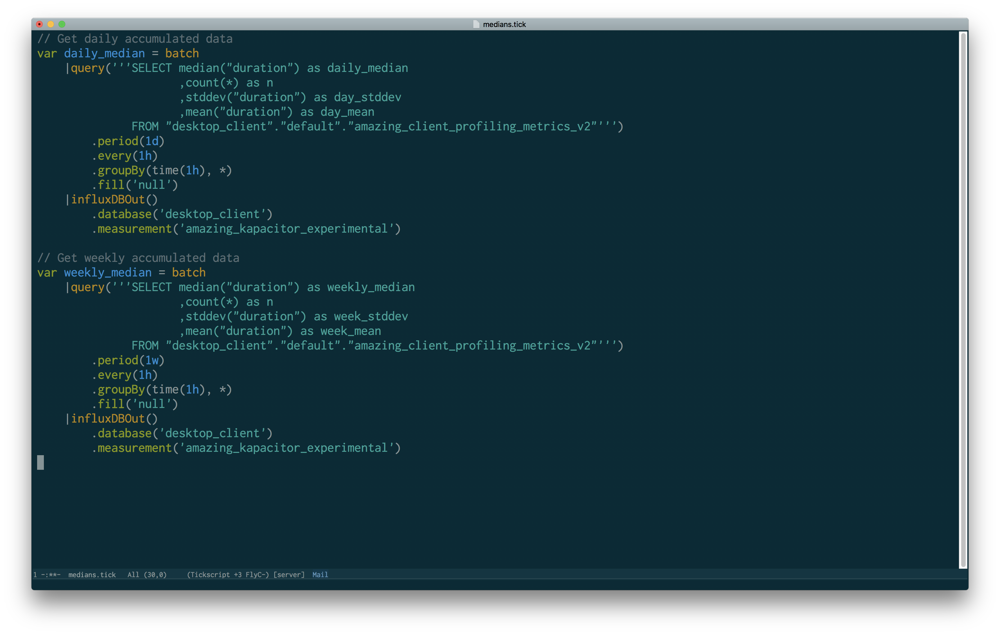

[](https://melpa.org/#/tickscript-mode)
[](https://stable.melpa.org/#/tickscript-mode)

# tickscript-mode
A major mode for Tickscript files

Copyright Marc Sherry <msherry@gmail.com>

Provides Emacs font-lock, indentation, navigation, and utility functions for
working with [TICKscript](https://docs.influxdata.com/kapacitor/v1.3/tick/), a
DSL for use with Kapacitor and InfluxDB.



## Installation

Available on [MELPA](https://melpa.org/) and [MELPA
Stable](https://stable.melpa.org/) -- installation from there is easiest:

<kbd>M-x package-install tickscript-mode</kbd>

Alternately, add the following to your .init.el:

```elisp
(add-to-list 'load-path "path-to-tickscript-mode")
(require 'tickscript-mode)
```

## Usage

In addition to syntax highlighting and indentation support,
`tickscript-mode` provides a number of utility functions for working
directly with Kapacitor:

* <kbd>C-c C-c</kbd> -- `tickscript-define-task`

  Send the current task to Kapacitor via `kapacitor define`.

* <kbd>C-c C-v</kbd> -- `tickscript-show-task`

  View the current task's definition with `kapacitor show <task>`

* <kbd>C-c C-l p</kbd> -- `tickscript-list-replays`
* <kbd>C-c C-l r</kbd> -- `tickscript-list-recordings`
* <kbd>C-c C-l t</kbd> -- `tickscript-list-tasks`

  Query Kapacitor for information about the specified objects.

Support is also provided for looking up node and property definitions:

* <kbd>C-c C-d</kbd> -- `tickscript-get-help`

  Look up the node, and possibly property, currently under point online.
